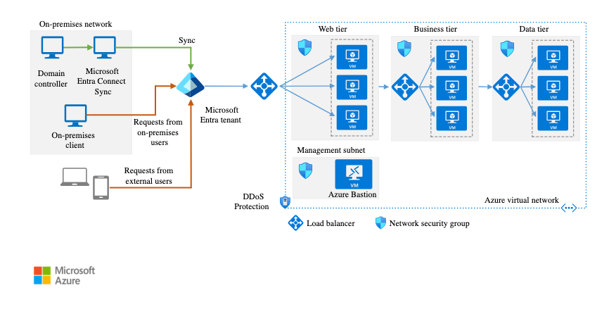

# What is EntraID
Entra ID is cloud-based identity and access management service by Microsoft. 
https://learn.microsoft.com/en-us/entra/fundamentals/what-is-entra 

# Identity Architecture
 

# Authentication

## Token
https://learn.microsoft.com/en-us/entra/identity/devices/concept-tokens-microsoft-entra-id 

|Token Type|Issued by|Purpose|Scoped to Resource|Lifetime|Revocable|Renewable|
|---|---|---|---|---|---|---|
|Primary Refresh Token (PRT)|Entra ID|Request Access Tokens|No – Can request an access token for any resource|90 days*|Yes|Yes|
|Refresh Token|Entra ID|Request Access Tokens|Yes|90 days*|Yes|Yes|
|Access Token|Entra ID|Access the resource|Yes|Variable 60-90 minutes|Yes, if CAE capable|No|
|App auth cookie|Web app|Access the resource|Yes|Determined by application|Depends on application|No|

### Primary Refresh Token(PRT)
https://learn.microsoft.com/ja-jp/entra/identity/devices/concept-primary-refresh-token?tabs=windows-prt-issued%2Cbrowser-behavior-windows%2Cwindows-prt-used%2Cwindows-prt-renewal%2Cwindows-prt-protection%2Cwindows-apptokens%2Cwindows-browsercookies%2Cwindows-mfa 

A Token used for SSO, Retrieving tokens such as Access token and Refresh token for M365 apps and conditional access 
### Refresh Token

### Access Token

### App Auth Cookie